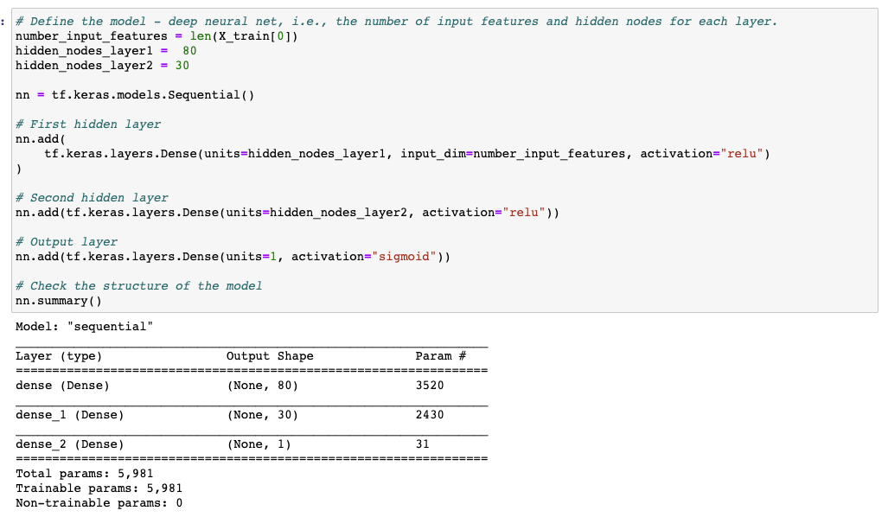
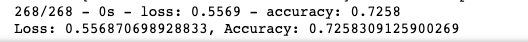
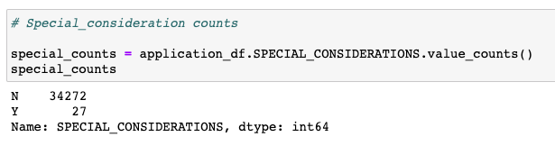
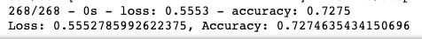
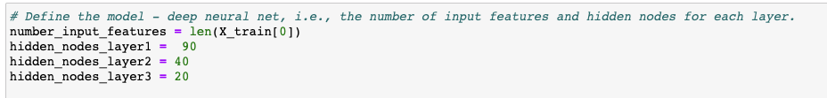
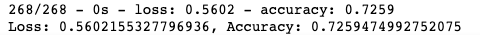
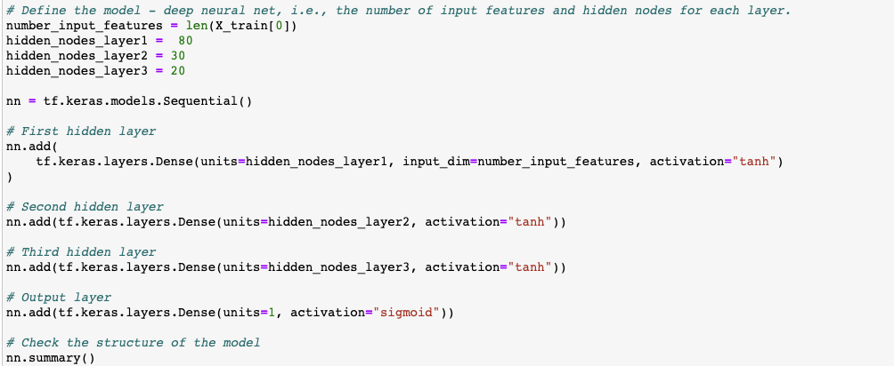
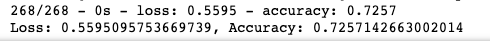

# Neural_Network_Charity_Analysis

## Overview of the analysis: 
To create a binary classifer to predict whether or not applicants will be successful if funded by the non-profit, Alphabet Soup. Alphabet soup provides funding to organizations that promote social and environmental improvements. Not every organization that is funded has a potitive impact with the amount they are granted. We want to be able to avoid providing money to organizations through this binary classifier. 

## Results: 
### Data Preprocessing
1. What variable(s) are considered the target(s) for your model?
- For this model, our target is to whether or not an organization will be successful if given funding from Alphabet soup. 
2. What variable(s) are considered to be the features for your model?
- Our features include: Application Type, Affiliation, Classification Use Cas, Organization, Status, Income Amout Special Considerations and Ask Amount.
3. What variable(s) are neither targets nor features, and should be removed from the input data?
- EIN and Name are neither a target or a feature. These are both indenficiation columns and don't explain the organization other than providing information similar to an ID number. 
4. Target model performance
- Target model performance is 75% or higher accuracy 
 
### Compiling, Training, and Evaluating the Model
1. How many neurons, layers, and activation functions did you select for your neural network model, and why?

- For the first attempt of using deep neural networks to train & test our dataset I had two hidden layers with 80 & 30 nodes. Hidden layers are very beneficial because they can evaluate higher order of interactions between weightd variables. They can identify complex nonlinear relationships across the entire dataset. The more neurons and hidden layers, the more they can identify and account for more information than any number of neurons in a single hidden layer. 
2. Were you able to achieve the target model performance?
- With two hidden layers of 80 and 30 nodes, the model was only able to achieve an accuracy of .73. This was not high enough to confidently predict an organization's success. 

3. What steps did you take to try and increase model performance?
- I attempted 3 different modiciations from the original model to increase model performance. This includes adjusting my preprocessing on the dataset, adding more neurons, hidden layers and lastly using different activation functions for the hiden layers. Unfortunately none of these adjustments were able to have the model perform equal or higher than 75% accuracy. 

#### Preprocessing differently, dropping another column 

When looking deeper at each column and what information they provide, special considerations caught my eye as another field they may not be a target or a feature. It didn't seem like the most telling inforamtion. This field appeared to only have N or Y as an input. Looking at the value_counts() for this column, only 27 of the over 34,000 rows of data had Y as an entry. For this reason I thought this may not be that useful of a column to keep, and maybe dropping the column could increase the model accuracy. 

Dropping the "SPECIAL_CONSIDERATION" column did not improve the accuracy. It was still about .73. 

#### Adding more neurons and hidden layers
For my second attempt, I kept the "SPECIAL_CONSIDERATIONS" column since removing it did not have an impact on the accuracy of the model. This time I increased the number of nodes, and added a hiddel layer to see if that would improve the model's accuracy. 

Unfortunately the accuracy of this model was almost the same as the prior two attempts, about .73.

#### Using a different activation function
For my third and final attempt, I had the same number of nodes for my first and second hidden layer as the original mode. I kept a third hidden layer with 20 nodes. Lastly, I changed my activation function for the hidden layers to "tanh" instead of "relu"

Changing the activation function did not impact the accuracy of the model. 

## Summary: 
Overall, through many attemps with deep learning neural networks, I was not able to achieve an accuracy of 75% or higher. Accuracy stayed consistently around 73% through the different modiciations I had attempted. This model is not reliable enough to use for Alphabet Soup to predict which organizations would be successful if given funding. Deep Learning models are supposed to have very high accuracy. Especially with adding another hidden layer. It is supposed to increase the accuracy of the model significatly, compared to only have 1 or 2 hidden layers. Since our model could not perform any high than 73% regardless of what I changed, I think its really hard to reccomend another model. In this case I feel that the data may not the best data to use for prediction models. No matter what you do, a bad dataset may just be a bad dataset, and any model may fail at having high prediction accuracy. I will say, given this, I might reccomend a SVM model purely because it can give a similar accuracy score with less code. Or a Random Forest Classifier to have a similar outcome that takes a less amount of time. However, a better dataset would be the most ideal in this case. 
